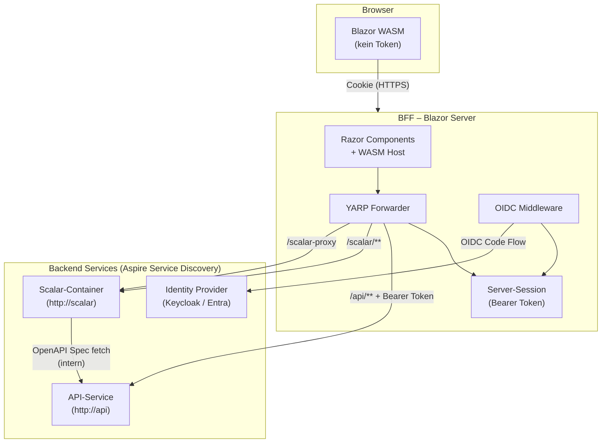
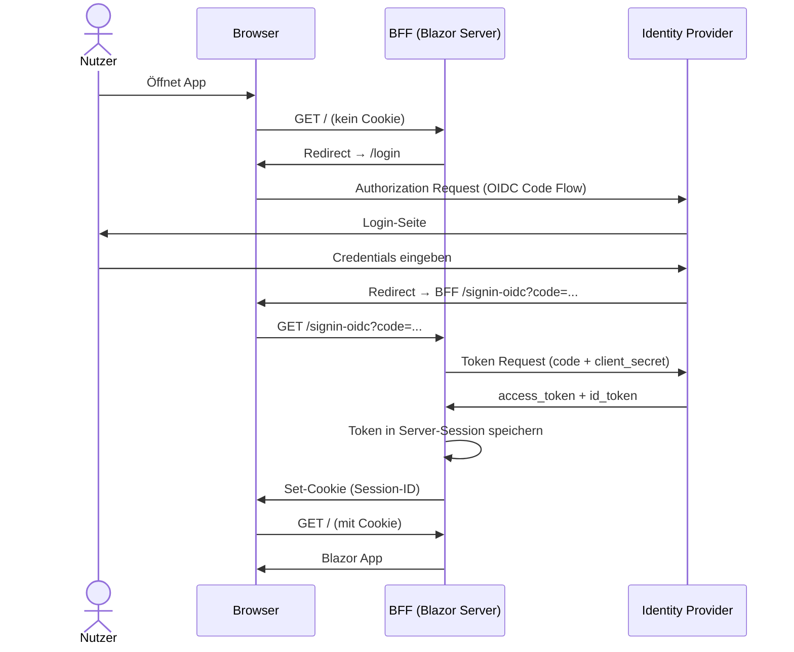
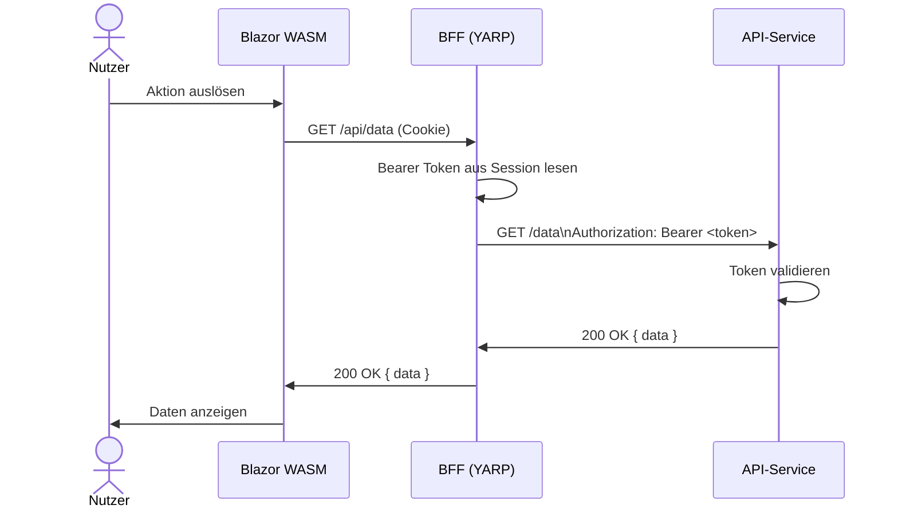
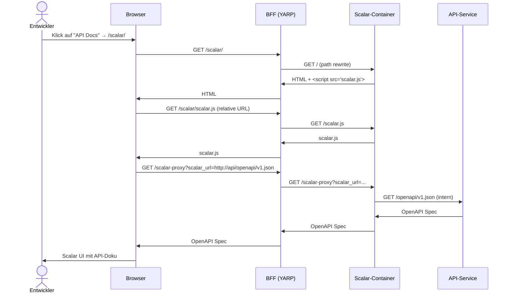

# Blazor WASM BFF mit YARP, Scalar und Bearer Auth

Ein häufiges Muster in .NET Aspire-Anwendungen: Eine Blazor Web App mit WebAssembly-Interaktion,
einem Backend-for-Frontend (BFF) als sicherer Mittelschicht, einer separaten API und einer
Scalar-Instanz für die API-Dokumentation.

## Architektur

### Systemdiagramm



### Datenfluss

#### Login



#### API-Aufruf



#### Scalar API-Dokumentation öffnen



Der BFF-Server speichert den Bearer Token sicher in der Server-Session.
Das WASM-Frontend selbst kennt kein Token und ruft alle Endpunkte relativ auf (`/api/...`).

## Warum `/scalar-proxy`?

Der Scalar-Container stellt unter `/scalar-proxy` einen internen HTTP-Proxy bereit,
über den die Scalar-UI die OpenAPI-Spezifikation vom API-Service lädt.
Da der Browser nicht direkt auf interne Service-Discovery-Adressen zugreifen kann,
muss auch dieser Endpunkt durch den BFF weitergeleitet werden.

## Setup

### 1. NuGet-Pakete (`MyBlazorBff.csproj`)

```xml
<Project Sdk="Microsoft.NET.Sdk.Web">
  <PropertyGroup>
    <TargetFramework>net10.0</TargetFramework>
  </PropertyGroup>
  <ItemGroup>
    <PackageReference Include="Microsoft.AspNetCore.Components.WebAssembly.Server" Version="10.0.0" />
    <PackageReference Include="Microsoft.Extensions.ServiceDiscovery.Yarp" Version="10.5.0" />
    <PackageReference Include="Microsoft.AspNetCore.Authentication.OpenIdConnect" Version="10.0.0" />
  </ItemGroup>
</Project>
```

### 2. `Program.cs`

```csharp
using System.Net.Http.Headers;
using Microsoft.AspNetCore.Authentication;
using Yarp.ReverseProxy.Forwarder;

var builder = WebApplication.CreateBuilder(args);

// Aspire Service Discovery
builder.Services.AddServiceDiscovery();

// YARP Direct Forwarding mit Service Discovery
builder.Services.AddHttpForwarderWithServiceDiscovery();

// OIDC Auth (Keycloak / Entra / beliebiger IdP)
builder.Services.AddAuthentication(options =>
    {
        options.DefaultScheme = "cookie";
        options.DefaultChallengeScheme = "oidc";
    })
    .AddCookie("cookie")
    .AddOpenIdConnect("oidc", options =>
    {
        options.Authority     = builder.Configuration["Oidc:Authority"];
        options.ClientId      = builder.Configuration["Oidc:ClientId"];
        options.ClientSecret  = builder.Configuration["Oidc:ClientSecret"];
        options.ResponseType  = "code";
        options.SaveTokens    = true;   // Token sicher in Session speichern
        options.Scope.Add("openid");
        options.Scope.Add("profile");
        options.Scope.Add("api");
    });

builder.Services.AddAuthorization();

builder.Services.AddRazorComponents()
    .AddInteractiveWebAssemblyComponents();

var app = builder.Build();

app.UseAuthentication();
app.UseAuthorization();

// Scalar UI — alle Sub-Ressourcen laufen über denselben Proxy-Eintrag,
// da der Browser auf derselben Origin bleibt und relative Asset-URLs
// (scalar.js, favicon, ...) ebenfalls diesen Eintrag treffen.
app.MapForwarder("/scalar/{**catch-all}", "http://scalar",
    new ForwarderRequestConfig(),
    HttpTransformer.Create((ctx, proxyReq, _) =>
    {
        var remaining = ctx.Request.Path.ToString()["/scalar".Length..];
        proxyReq.RequestUri = new Uri(
            "http://scalar" + (remaining is "" or "/" ? "/" : remaining)
            + ctx.Request.QueryString);
        return ValueTask.CompletedTask;
    }));

// Scalar-interner Proxy zum Laden der OpenAPI-Spezifikation
app.MapForwarder("/scalar-proxy", "http://scalar/scalar-proxy");

// API — Bearer Token aus BFF-Session anhängen
app.MapForwarder("/api/{**catch-all}", "http://api",
    new ForwarderRequestConfig(),
    HttpTransformer.Create(async (ctx, proxyReq, _) =>
    {
        var token = await ctx.GetTokenAsync("access_token");
        if (token is not null)
        {
            proxyReq.Headers.Authorization =
                new AuthenticationHeaderValue("Bearer", token);
        }
    })).RequireAuthorization();

app.MapStaticAssets();
app.MapRazorComponents<App>()
    .AddInteractiveWebAssemblyRenderMode()
    .AddAdditionalAssemblies(typeof(MyBlazorBff.Client._Imports).Assembly);

app.Run();
```

### 3. `appsettings.json` (BFF)

```json
{
  "Oidc": {
    "Authority": "https://your-idp.example.com",
    "ClientId": "bff-client",
    "ClientSecret": "your-secret"
  }
}
```

### 4. AppHost

```csharp
var api = builder.AddProject<Projects.MyApi>("api");

var scalar = builder.AddScalarApiReference("scalar", options =>
        options.WithTheme(ScalarTheme.Default))
    .WithApiReference(api);

var bff = builder.AddProject<Projects.MyBlazorBff>("bff")
    .WithReference(api)      // → services__api__http__0
    .WithReference(scalar)   // → services__scalar__http__0
    .WithExternalHttpEndpoints();
```

Aspire Service Discovery löst `http://api` und `http://scalar` zur Laufzeit auf die
tatsächlichen Container-Adressen auf — keine Hardcodierung notwendig.

## Warum kein Token im WASM-Client?

Das ist der zentrale Vorteil des BFF-Patterns:

| Ansatz | Token-Speicherort | Risiko |
|---|---|---|
| WASM direkt (PKCE) | `localStorage` / Memory | XSS kann Token stehlen |
| BFF | Server-Session (Cookie) | Token verlässt nie den Browser |

Der WASM-Client ruft ausschließlich `/api/...` relativ auf.
Der BFF-Server hängt den Bearer Token serverseitig an — das WASM-Bundle selbst enthält kein Token.
