# Dokploy Deployment Architecture

This document explains how `Sorvia.Aspire.Hosting.Dokploy` deploys a .NET Aspire application to Dokploy. It covers both supported AppHost APIs, the Aspire publishing pipeline, Docker Compose artifact generation, Dokploy API orchestration, registry handling, native database provisioning, environment variable resolution, domains, and deployment summaries.

## Supported entry points

The package exposes two equivalent ways to enable Dokploy deployment.

### High-level shortcut

```csharp
builder.AddDokployEnvironment("demo-dokploy");
```

`AddDokployEnvironment` creates an Aspire Docker Compose publishing environment and immediately configures that environment to deploy through Dokploy.

### Explicit Docker Compose adapter

```csharp
builder.AddDockerComposeEnvironment("demo")
    .WithDokployDeploymentTarget();
```

Use this form when the AppHost wants explicit access to the Docker Compose environment API, for example to customize Compose output or captured environment variables with `ConfigureComposeFile(...)` or `ConfigureEnvFile(...)`.

Both forms converge on the same implementation:

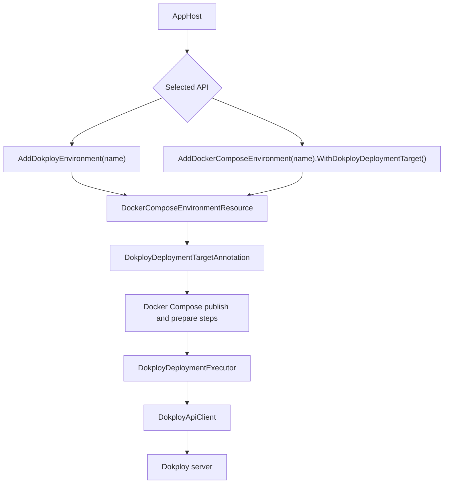

## Runtime modes

The integration is intentionally inactive during normal local run mode. This keeps local development behavior identical to a regular Aspire application.

| Mode | Behavior |
| --- | --- |
| Run mode | The Dokploy deployment target does not add deploy behavior. The app runs locally as usual. |
| Publish mode | Docker Compose artifacts are generated by Aspire's Docker publisher. Dokploy parameters are registered. |
| Deploy mode | The Docker Compose deploy step is replaced with Dokploy REST API orchestration. |

## Main components

| Component | Responsibility |
| --- | --- |
| `DokployEnvironmentExtensions` | Public API surface. Adds `AddDokployEnvironment(...)` and `WithDokployDeploymentTarget(...)`. |
| `DockerComposeEnvironmentResource` | The upstream Aspire Docker Compose publishing environment. It owns the normal publish and prepare pipeline steps. |
| `DokployDeploymentTargetAnnotation` | Stores Dokploy configuration and captures the generated Compose services after Docker Compose publishing has built the Compose model. |
| `DokployDeploymentExecutor` | Executes the Dokploy deployment flow during the replaced deploy step. |
| `DokployApiClient` | Typed wrapper around the Dokploy REST API endpoints used by deployment. |
| `DokployDatabaseAnnotation` | Marks database resources that should be provisioned as Dokploy-native databases instead of application containers. |

## Pipeline integration

The package does not reimplement the full Aspire Docker Compose publisher. Instead, it reuses the stock publisher and swaps the final delivery step.

1. `AddDockerComposeEnvironment(...)` creates a normal Docker Compose publishing environment.
2. `WithDokployDeploymentTarget(...)` adds a `DokployDeploymentTargetAnnotation`.
3. The annotation registers a `ConfigureComposeFile(...)` callback that captures generated Compose service data.
4. The extension wraps the environment's `PipelineStepAnnotation`.
5. The wrapper removes the stock `docker-compose-up-{name}` step.
6. The wrapper adds a new step with the same step name, but the action calls `DokployDeploymentExecutor`.
7. The new step still depends on `prepare-{name}` and is still required by Aspire's `Deploy` step.

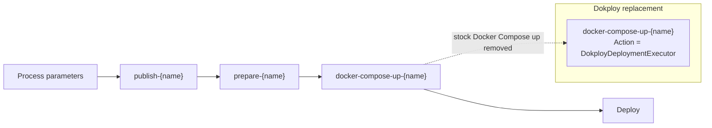

The step name is intentionally kept as `docker-compose-up-{name}` because it is part of the Docker Compose publisher pipeline shape. Keeping the name allows the rest of the Aspire deployment dependency graph to stay compatible while changing only the action that runs at that point.

## Parameter registration and configuration

In publish/deploy mode, the Dokploy target registers Aspire parameters:

| Parameter | Purpose | Notes |
| --- | --- | --- |
| `dokploy-url` | Base URL of the Dokploy instance | Host names without a scheme are normalized to `https://...`. |
| `dokploy-api-key` | Dokploy API key | Registered as a secret parameter. |
| `dokploy-project-name` | Dokploy project name | Defaults to the environment name in the prompt. |
| `dokploy-environment` | Dokploy environment inside the project | Defaults to `production`; empty values also become `production`. |

The executor resolves configuration from the shared deployment annotation. Direct values can be stored on the annotation, and parameter-backed values are resolved from Aspire deployment state at execution time. This gives both public APIs the same behavior.

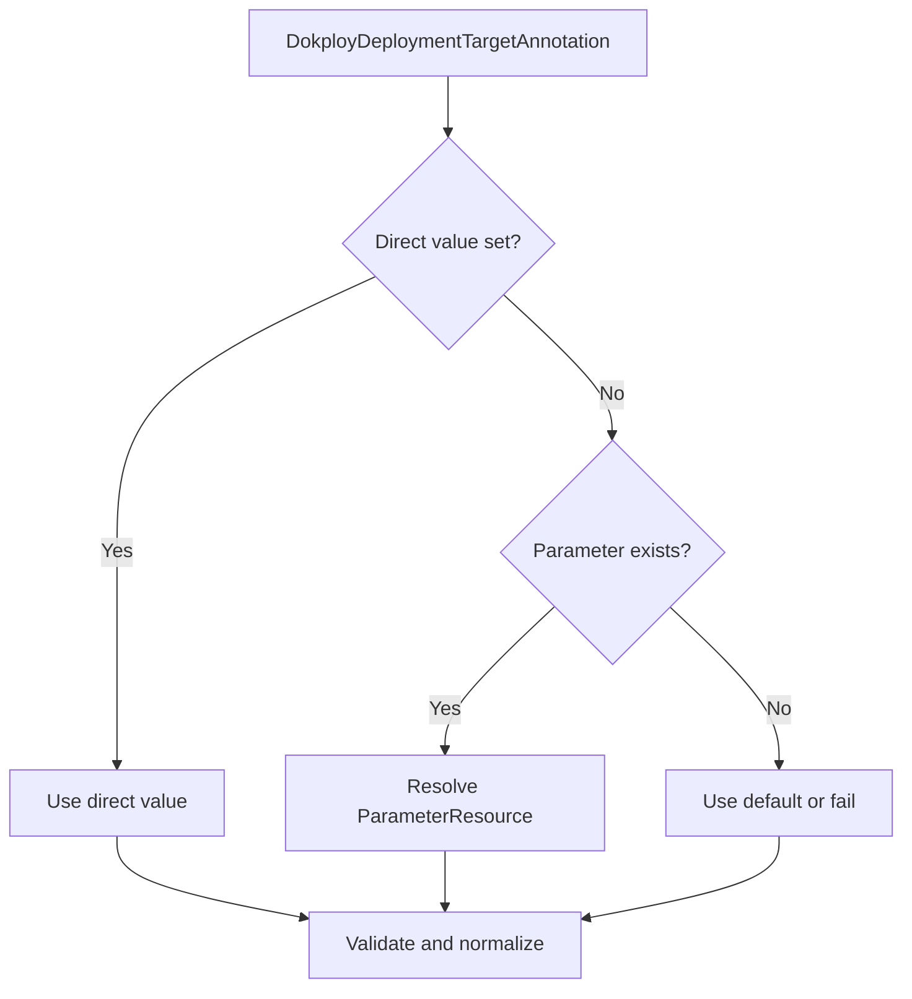

## Compose service capture

The Docker Compose publisher builds a `ComposeFile` model before writing `docker-compose.yaml`. The Dokploy target registers a `ConfigureComposeFile(...)` callback so it can inspect that model and capture the parts needed by Dokploy:

- Compose service name
- Docker image reference
- entrypoint
- command

This captured data is stored in `DokployDeploymentTargetAnnotation` as `DokployPublishedComposeService` records.

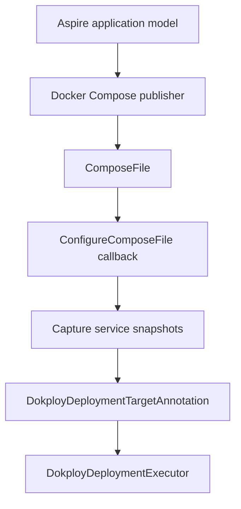

The executor only deploys compute resources that have a captured Compose service. This prevents non-compute resources and Dokploy-native database resources from being deployed as generic application containers.

## Full deployment sequence

When the replaced deploy step runs, `DokployDeploymentExecutor` performs the following high-level sequence.

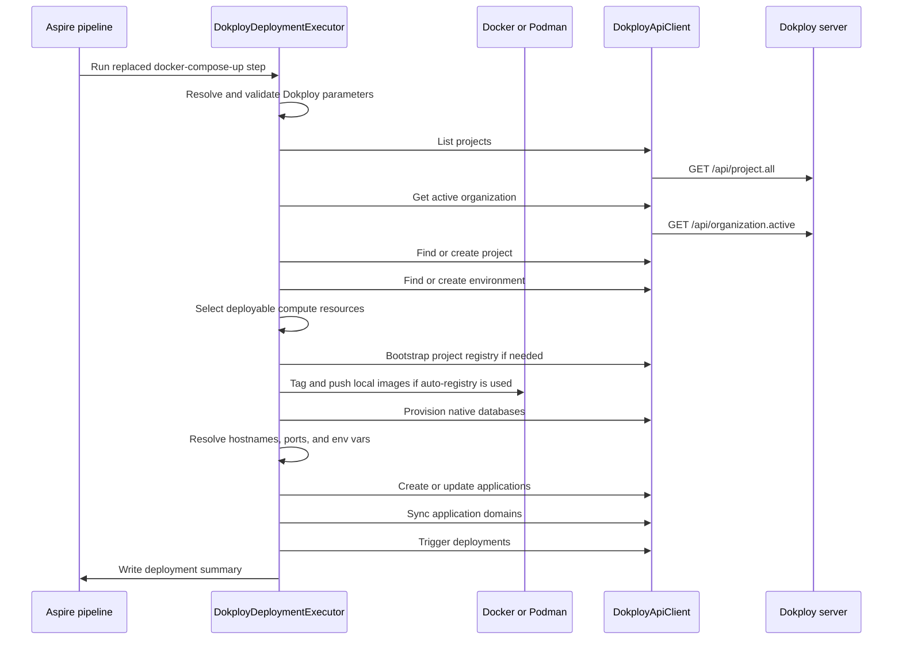

## Project and environment reconciliation

Dokploy groups deployed services into projects and environments. The executor first resolves the target project name and Dokploy environment name, then reconciles both on the server.

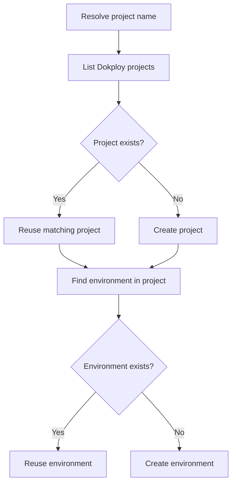

If the API key has an active organization, project matching is scoped to that organization. This avoids accidentally reusing a same-named project from another organization.

## Resource selection

Not every Aspire resource becomes a Dokploy application. The executor filters the model to include only deployable compute resources:

- `ProjectResource`
- `ContainerResource`
- `DockerComposeAspireDashboardResource`

The executor excludes:

- the `DockerComposeEnvironmentResource` itself
- resources annotated with `DokployDatabaseAnnotation`
- resources that do not have a captured Compose service

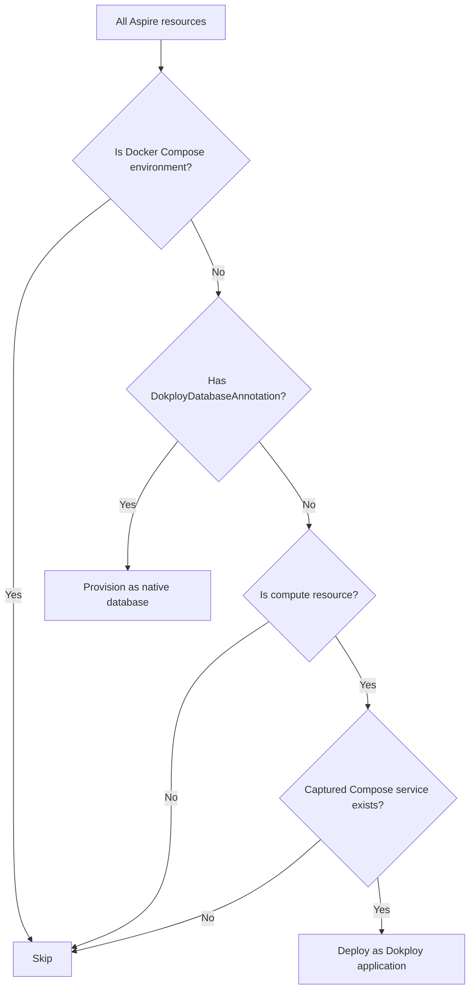

The Aspire Dashboard is included when the Docker Compose environment publishes it. Dashboard service data comes from the Docker Compose publisher, the same as every other compute service.

## Container image and registry handling

Dokploy needs to pull container images from a registry. Locally built Aspire project images are not automatically pullable by a remote Dokploy server, so the integration has two paths.

### Explicit registry path

If the environment or resources use an explicit `IContainerRegistry`, the executor assumes images are published to that registry by the existing Aspire build and push pipeline. The executor then configures Dokploy applications with those image references.

### Auto-bootstrap registry path

If no default registry and no per-resource registry references are configured, the executor creates a private registry inside the Dokploy project:

1. Derive an `sslip.io` registry host from the Dokploy server.
2. Generate deterministic registry credentials using project ID, host, and API key.
3. Create or reuse a Dokploy Compose service running `registry:2`.
4. Configure htpasswd authentication.
5. Add an HTTPS domain for the registry.
6. Wait until registry credentials work.
7. Register or update the registry in Dokploy.
8. Tag local images with the new registry prefix.
9. Push images using Docker or Podman.

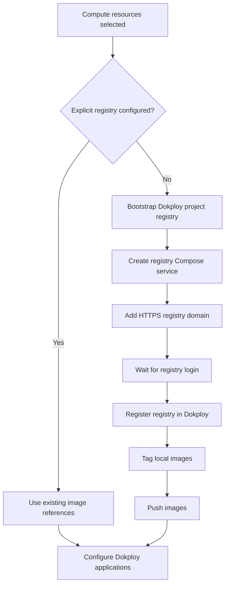

The Aspire Dashboard image is already public, so it is not pushed to the auto-bootstrapped project registry.

## Native database provisioning

Database resources can be provisioned as Dokploy-native databases instead of normal application containers. This is controlled by `DokployDatabaseAnnotation`, which is added by APIs such as:

```csharp
builder.AddDokployPostgres("postgres");
builder.AddPostgres("postgres").PublishAsDokployDatabase();
builder.AddMySql("mariadb").PublishAsDokployMariaDB();
```

Supported native database types:

| Aspire/Dokploy type | Dokploy API group |
| --- | --- |
| PostgreSQL | `postgres.*` |
| Redis | `redis.*` |
| MySQL | `mysql.*` |
| MariaDB | `mariadb.*` |
| MongoDB | `mongo.*` |

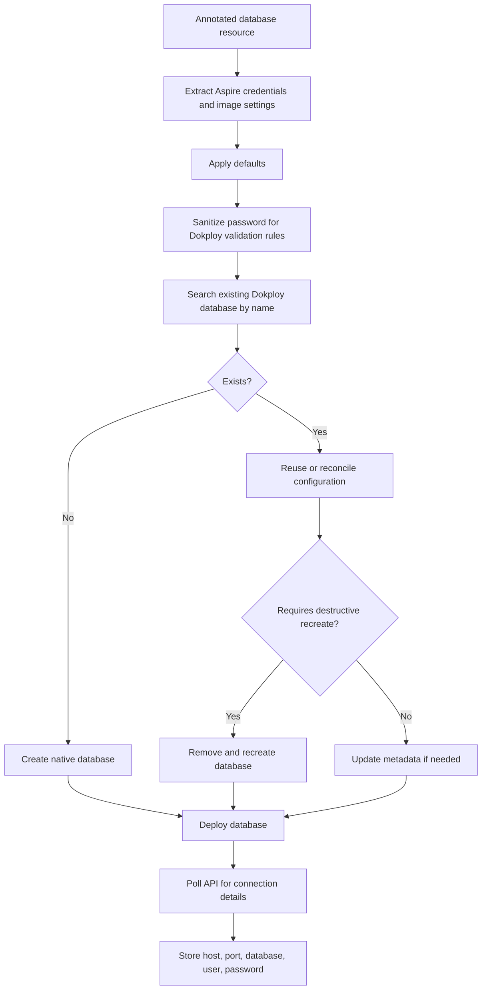

The resulting connection details are later used when resolving application environment variables and connection strings.

## Environment variable resolution

Aspire resources often express environment variables through structured values instead of plain strings. Examples include `EndpointReference`, `ConnectionStringReference`, `ReferenceExpression`, and `ParameterResource`.

The executor resolves these values structurally instead of blindly calling `ToString()`.

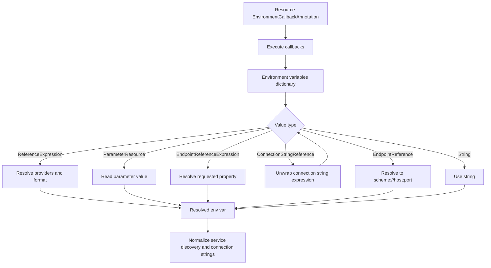

Two important normalizations happen after initial resolution:

1. Composite service discovery values like `https+http://service` are replaced with the resolved HTTP URL when the Docker Compose publisher emitted service discovery variables.
2. `ConnectionStrings__*` values that point at Dokploy-native database hosts are rewritten with the actual host, port, database name, user, and password returned by Dokploy.

## Application configuration

Each selected compute resource becomes a Dokploy application. The executor reconciles the application shell first, then updates its runtime configuration.

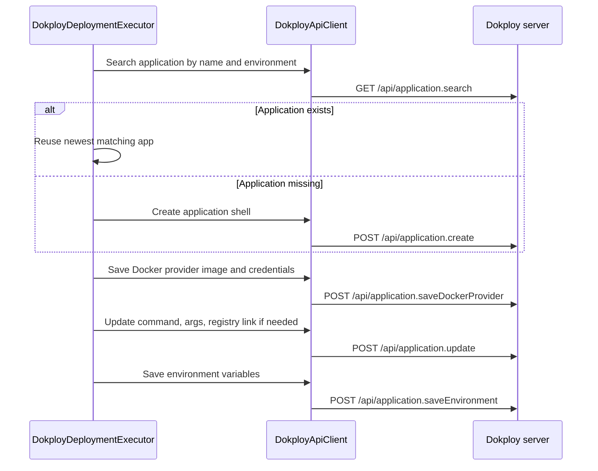

Application names are sanitized from Aspire resource names so they are safe as Docker/Dokploy identifiers.

## Domain synchronization

Domains are managed only for resources that expose external HTTP or HTTPS endpoints. Internal-only services are still deployed, but no public domain is created for them.

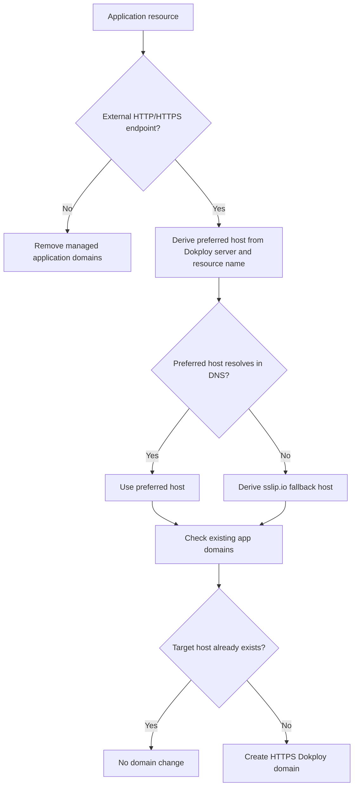

This keeps public endpoints deterministic while still providing a fallback for self-hosted Dokploy instances where custom DNS is not configured.

## Deployment triggering and summary

After applications are configured, the executor calls Dokploy's deploy endpoint for each application. Dokploy then pulls the configured image and starts or restarts the container.

Finally, the executor writes an Aspire pipeline summary containing:

| Summary item | Meaning |
| --- | --- |
| Target | Always `Dokploy`. |
| Server | Normalized Dokploy server URL. |
| Organization | Active Dokploy organization, when available. |
| Project | Target Dokploy project. |
| Environment | Target Dokploy environment. |
| Application links | Public HTTPS links for resources with managed domains. |
| Registry | Auto-bootstrapped project registry host, when used. |
| Database endpoints | Native database host and port details. |

## Error handling model

The deployment is designed to fail fast for configuration and server access problems:

- missing API key
- blank or invalid server URL
- unreachable Dokploy API
- failed project/environment creation
- failed registry bootstrap
- failed image push
- failed database provisioning
- failed application configuration
- failed deployment trigger

Some read-only discovery operations are best-effort. For example, domain discovery can return an empty set if Dokploy does not return the expected shape. These cases affect optional synchronization decisions, but write operations still surface failures.

## End-to-end mental model

The integration can be summarized as:

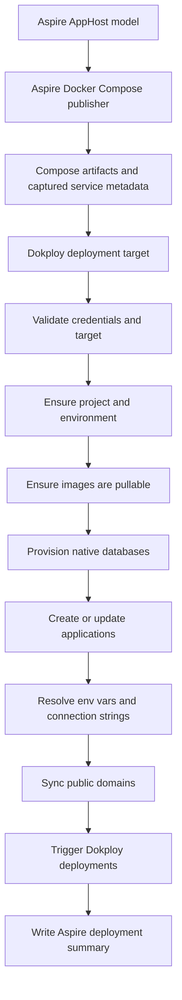

In other words, Aspire still describes and publishes the distributed application. Dokploy becomes the deployment backend that receives the published service metadata, receives or provisions the infrastructure it needs, and runs the application on the target Dokploy server.
