# Dokploy Deployment Architecture

This document explains how `Sorvia.Aspire.Hosting.Dokploy` deploys and destroys a .NET Aspire application on Dokploy. It covers both supported AppHost APIs, the Aspire publishing pipeline, Docker Compose artifact generation, Dokploy API orchestration, registry handling, native database provisioning, environment variable resolution, domains, deployment summaries, and cleanup behavior.

## Supported entry points

The package exposes two equivalent ways to enable Dokploy deployment.

### High-level shortcut

```csharp
builder.AddDokployEnvironment("demo-dokploy");
```

`AddDokployEnvironment` creates an Aspire Docker Compose publishing environment and immediately configures that environment to deploy through Dokploy.

### Explicit Docker Compose adapter

```csharp
builder.AddDockerComposeEnvironment("demo")
    .WithDokployDeploymentTarget();
```

Use this form when the AppHost wants explicit access to the Docker Compose environment API, for example to customize Compose output or captured environment variables with `ConfigureComposeFile(...)` or `ConfigureEnvFile(...)`.

Both forms converge on the same implementation:

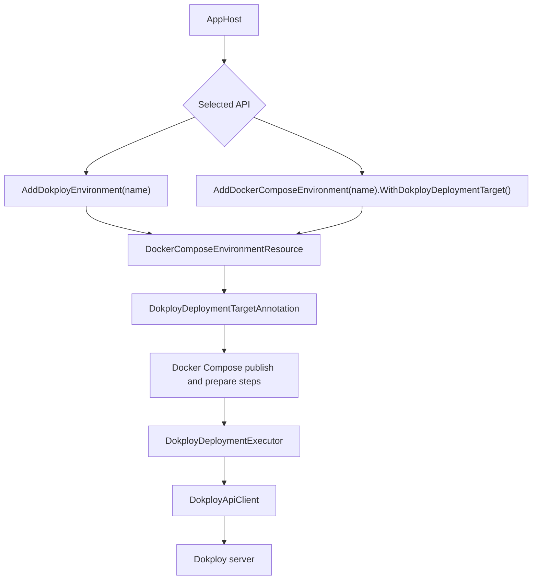

## Runtime modes

The integration is intentionally inactive during normal local run mode. This keeps local development behavior identical to a regular Aspire application.

| Mode | Behavior |
| --- | --- |
| Run mode | The Dokploy deployment target does not add deploy behavior. The app runs locally as usual. |
| Publish mode | Docker Compose artifacts are generated by Aspire's Docker publisher. Dokploy parameters are registered. |
| Deploy mode | The Docker Compose deploy step is replaced with Dokploy REST API orchestration. |
| Destroy mode | The Docker Compose destroy step is replaced with Dokploy cleanup orchestration. |

## Main components

| Component | Responsibility |
| --- | --- |
| `DokployEnvironmentExtensions` | Public API surface. Adds `AddDokployEnvironment(...)` and `WithDokployDeploymentTarget(...)`. |
| `DockerComposeEnvironmentResource` | The upstream Aspire Docker Compose publishing environment. It owns the normal publish and prepare pipeline steps. |
| `DokployDeploymentTargetAnnotation` | Stores Dokploy configuration and captures the generated Compose services after Docker Compose publishing has built the Compose model. |
| `DokployDeploymentExecutor` | Executes the Dokploy deployment and destroy flows during the replaced pipeline steps. |
| `DokployApiClient` | Typed wrapper around the Dokploy REST API endpoints used by deployment. |
| `DokployDatabaseAnnotation` | Marks database resources that should be provisioned as Dokploy-native databases instead of application containers. |

## Pipeline integration

The package does not reimplement the full Aspire Docker Compose publisher. Instead, it reuses the stock publisher and swaps the final delivery action for named Dokploy phases. A no-op compatibility bridge keeps the stock step name available because Aspire's generated build steps reference it through `RequiredBySteps`; that bridge does not run Docker Compose.

1. `AddDockerComposeEnvironment(...)` creates a normal Docker Compose publishing environment.
2. `WithDokployDeploymentTarget(...)` adds a `DokployDeploymentTargetAnnotation`.
3. The annotation registers a `ConfigureComposeFile(...)` callback that captures generated Compose service data.
4. The extension wraps the environment's `PipelineStepAnnotation`.
5. The wrapper removes the stock `docker-compose-up-{name}` action and replaces it with a no-op compatibility bridge of the same name.
6. The wrapper adds named deploy phases: `dokploy-validate-{name}`, `dokploy-project-{name}`, `dokploy-registry-{name}`, `dokploy-images-{name}`, `dokploy-databases-{name}`, `dokploy-applications-{name}`, `dokploy-release-{name}`, and `dokploy-summary-{name}`.
7. The first Dokploy deploy phase depends on `prepare-{name}`. `dokploy-images-{name}` depends on the compatibility bridge so Aspire's generated `build-*` steps still run before images are pushed. The final `dokploy-summary-{name}` phase is required by Aspire's `Deploy` step.
8. The wrapper also removes the stock `destroy-compose-{name}` action, replaces it with a no-op compatibility bridge, and adds named destroy phases from `dokploy-destroy-validate-{name}` through `dokploy-destroy-summary-{name}`. The final destroy summary phase is required by Aspire's `Destroy` step.

```mermaid
flowchart LR
    A["Process parameters"] --> B["publish-{name}"]
    B --> C["prepare-{name}"]
    C --> D["docker-compose-up-{name}<br/>compat bridge"]
    C --> V["dokploy-validate-{name}"]
    V --> P["dokploy-project-{name}"]
    P --> R["dokploy-registry-{name}"]
    R --> I["dokploy-images-{name}"]
    D --> I
    I --> DB["dokploy-databases-{name}"]
    DB --> APP["dokploy-applications-{name}"]
    APP --> REL["dokploy-release-{name}"]
    REL --> SUM["dokploy-summary-{name}"]
    SUM --> E["Deploy"]
    F["Destroy prerequisites"] --> G["destroy-compose-{name}<br/>compat bridge"]
    G --> DV["dokploy-destroy-validate-{name}"]
    DV --> DD["dokploy-destroy-discover-{name}"]
    DD --> DA["dokploy-destroy-applications-{name}"]
    DA --> DDB["dokploy-destroy-databases-{name}"]
    DDB --> DR["dokploy-destroy-registry-{name}"]
    DR --> DP["dokploy-destroy-project-{name}"]
    DP --> DS["dokploy-destroy-summary-{name}"]
    DS --> H["Destroy"]

    subgraph Replacement["Dokploy replacement"]
        V
        P
        R
        I
        DB
        APP
        REL
        SUM
        DV
        DD
        DA
        DDB
        DR
        DP
        DS
    end

    D -. "stock Docker Compose up action removed" .-> V
    G -. "stock Docker Compose destroy action removed" .-> DV
```

The Dokploy replacement steps use Dokploy-specific names so Aspire CLI output shows prefixes such as `dokploy-registry-{name}`, `dokploy-applications-{name}`, and `dokploy-destroy-registry-{name}` instead of one large Docker Compose execution step. The old Docker Compose step names can still appear as short `dokploy-compat` bridge steps, but they only preserve Aspire's generated build/destroy dependencies and do not perform deployment work.

## Parameter registration and configuration

In publish/deploy mode, the Dokploy target registers Aspire parameters:

| Parameter | Purpose | Notes |
| --- | --- | --- |
| `dokploy-url` | Base URL of the Dokploy instance | Host names without a scheme are normalized to `https://...`. |
| `dokploy-api-key` | Dokploy API key | Registered as a secret parameter. |
| `dokploy-project-name` | Dokploy project name | Defaults to the environment name in the prompt. |
| `dokploy-environment` | Dokploy environment inside the project | Defaults to `production`; empty values also become `production`. |

The executor resolves configuration from the shared deployment annotation. Direct values can be stored on the annotation, and parameter-backed values are resolved from Aspire deployment state at execution time. This gives both public APIs the same behavior.

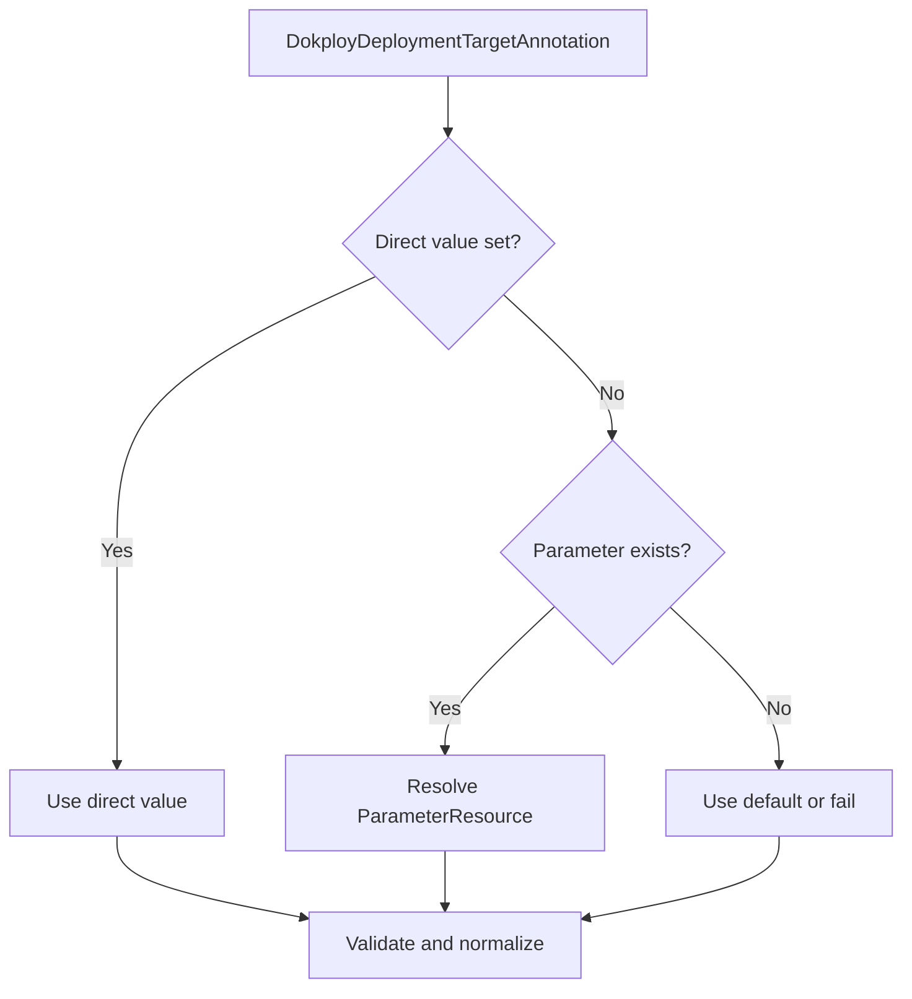

## Compose service capture

The Docker Compose publisher builds a `ComposeFile` model before writing `docker-compose.yaml`. The Dokploy target registers a `ConfigureComposeFile(...)` callback so it can inspect that model and capture the parts needed by Dokploy:

- Compose service name
- Docker image reference
- entrypoint
- command

This captured data is stored in `DokployDeploymentTargetAnnotation` as `DokployPublishedComposeService` records.

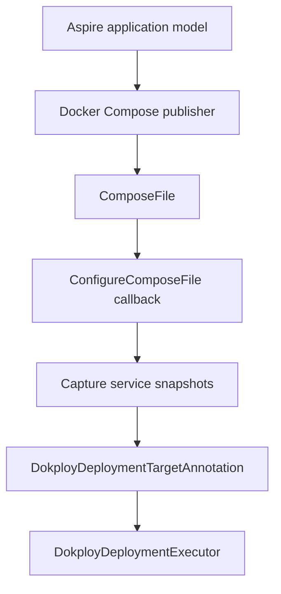

The executor only deploys compute resources that have a captured Compose service. This prevents non-compute resources and Dokploy-native database resources from being deployed as generic application containers.

## Full deployment sequence

When the Dokploy deploy phases run, `DokployDeploymentExecutor` performs the following high-level sequence. Each pipeline phase stores shared deployment state and the next phase resumes from that state.

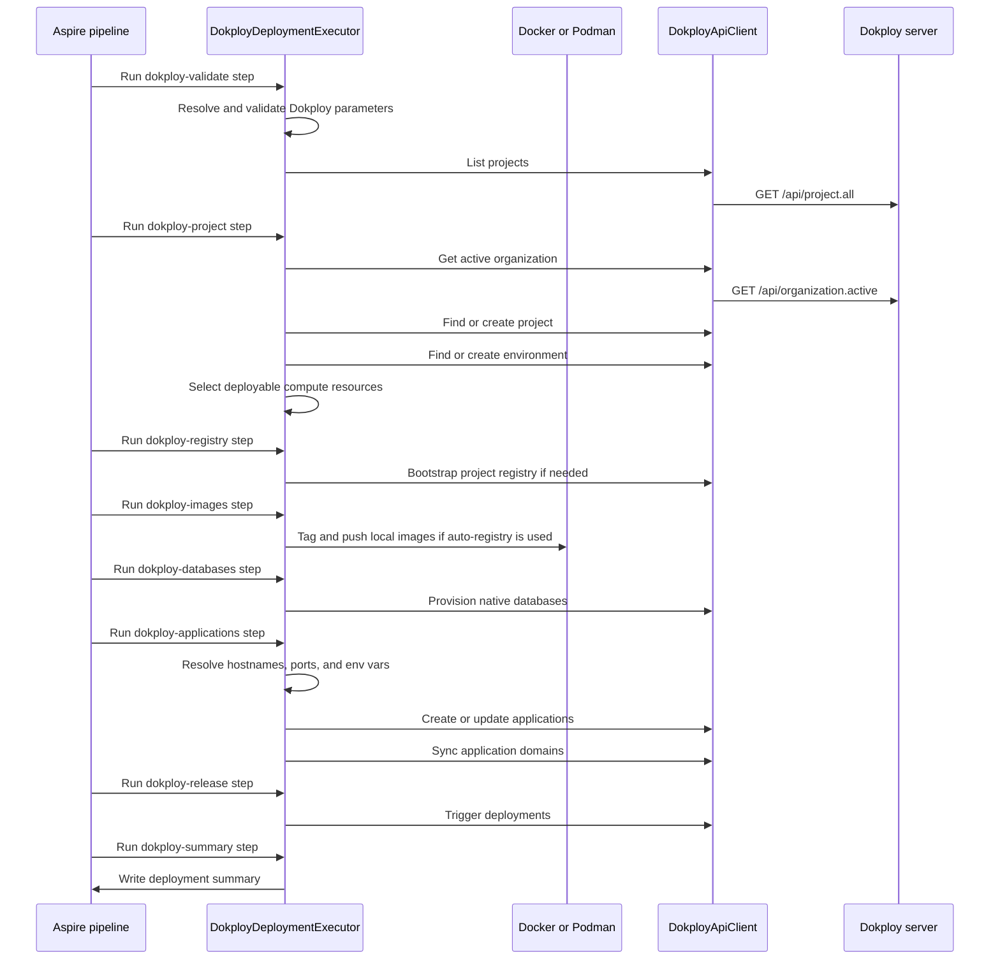

## Project and environment reconciliation

Dokploy groups deployed services into projects and environments. The executor first resolves the target project name and Dokploy environment name, then reconciles both on the server.

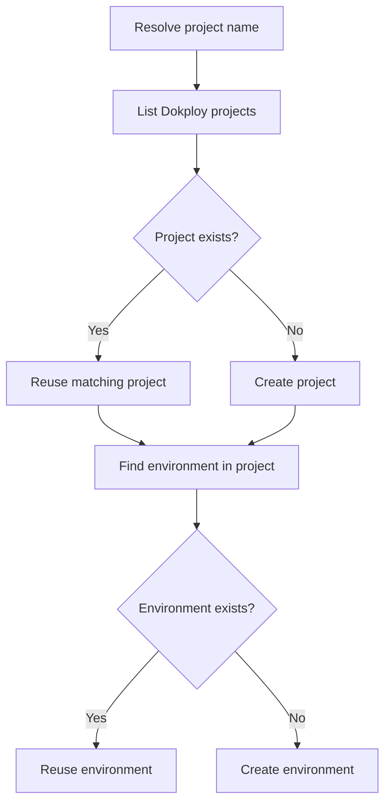

If the API key has an active organization, project matching is scoped to that organization. This avoids accidentally reusing a same-named project from another organization.

## Resource selection

Not every Aspire resource becomes a Dokploy application. The executor filters the model to include only deployable compute resources:

- `ProjectResource`
- `ContainerResource`
- `DockerComposeAspireDashboardResource`

The executor excludes:

- the `DockerComposeEnvironmentResource` itself
- resources annotated with `DokployDatabaseAnnotation`
- resources that do not have a captured Compose service

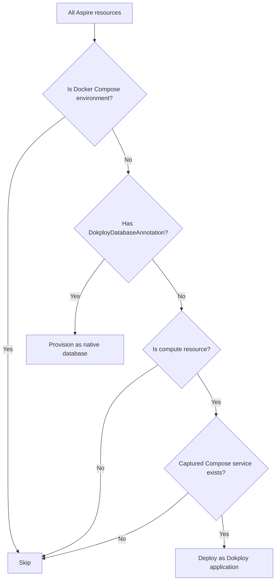

The Aspire Dashboard is included when the Docker Compose environment publishes it. Dashboard service data comes from the Docker Compose publisher, the same as every other compute service.

## Container image and registry handling

Dokploy needs to pull container images from a registry. Locally built Aspire project images are not automatically pullable by a remote Dokploy server, so the integration has two paths.

### Explicit registry path

If the environment or resources use an explicit `IContainerRegistry`, the executor assumes images are published to that registry by the existing Aspire build and push pipeline. The executor then configures Dokploy applications with those image references.

### Auto-bootstrap registry path

If no default registry and no per-resource registry references are configured, the executor creates a private registry inside the Dokploy project:

1. Reuse an existing Dokploy registry record when one already matches the project registry name or the existing compose-domain host.
2. Prefer an existing registry compose domain when one is already attached to the Dokploy compose service. If the registry record points at a stale host, defer updating the registry record until the effective host accepts HTTPS registry logins, because Dokploy validates `registry.update` with Docker login.
3. Probe the effective registry host with the registry record credentials.
4. If the live registry rejects those credentials, repair the existing registry Compose service by writing htpasswd credentials that match the registry record, then redeploy that existing compose service.
5. If no registry record or compose domain exists, derive an `sslip.io` registry host from the Dokploy server, project slug, and a short project ID suffix. This keeps recreated Dokploy projects with the same name from fighting over stale Traefik routes and credentials.
6. Generate deterministic registry credentials using project ID, the effective host, and API key when Dokploy does not expose stored credentials on the registry record.
7. Create or reuse a Dokploy Compose service running `registry:2`.
8. Configure htpasswd authentication directly in the Compose file so the registry container receives the credentials without depending on Dokploy Compose env interpolation. The registry service overrides the container entrypoint with a small shell bootstrap that writes `/auth/htpasswd` before handing control back to the official registry entrypoint.
9. Store a stable credential fingerprint next to the generated htpasswd payload. The bcrypt hash value is intentionally ignored during comparisons because it is re-salted every run.
10. Add an HTTPS domain for the registry when missing and no existing registry record/domain can be reused.
11. Deploy or redeploy the registry Compose service only when it is new, changed, missing a domain, or not accepting the expected credentials.
12. Wait until registry credentials work after setup or repair work.
13. Register or update the registry in Dokploy.
14. Tag local images with the new registry prefix.
15. Push images using Docker or Podman.

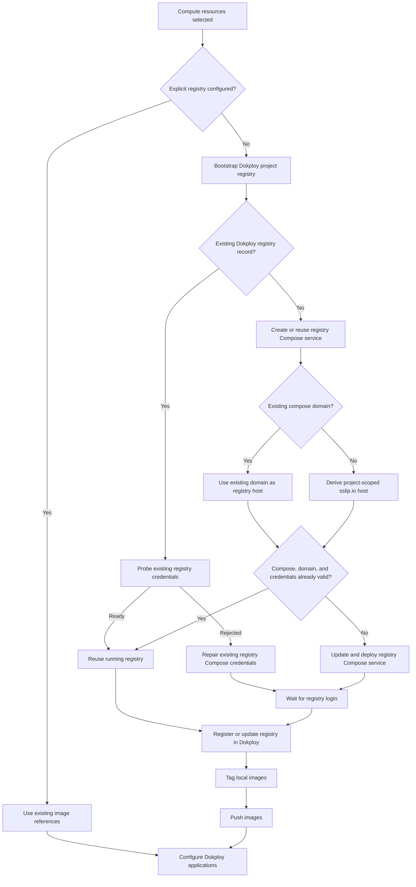

The Aspire Dashboard image is already public, so it is not pushed to the auto-bootstrapped project registry.

## Native database provisioning

Database resources can be provisioned as Dokploy-native databases instead of normal application containers. This is controlled by `DokployDatabaseAnnotation`, which is added by APIs such as:

```csharp
builder.AddDokployPostgres("postgres");
builder.AddPostgres("postgres").PublishAsDokployDatabase();
builder.AddMySql("mariadb").PublishAsDokployMariaDB();
```

Supported native database types:

| Aspire/Dokploy type | Dokploy API group |
| --- | --- |
| PostgreSQL | `postgres.*` |
| Redis | `redis.*` |
| MySQL | `mysql.*` |
| MariaDB | `mariadb.*` |
| MongoDB | `mongo.*` |

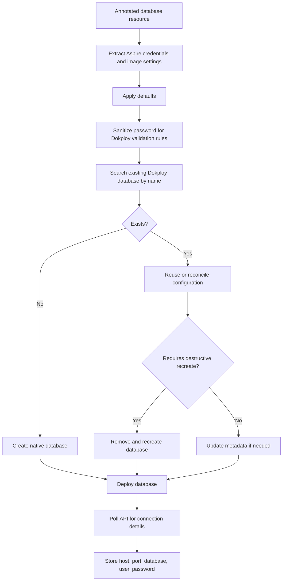

The resulting connection details are later used when resolving application environment variables and connection strings.

## Environment variable resolution

Aspire resources often express environment variables through structured values instead of plain strings. Examples include `EndpointReference`, `ConnectionStringReference`, `ReferenceExpression`, and `ParameterResource`.

The executor resolves these values structurally instead of blindly calling `ToString()`.

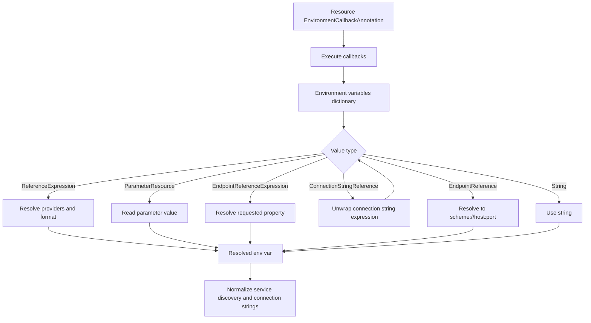

Two important normalizations happen after initial resolution:

1. Composite service discovery values like `https+http://service` are replaced with the resolved HTTP URL when the Docker Compose publisher emitted service discovery variables.
2. `ConnectionStrings__*` values that point at Dokploy-native database hosts are rewritten with the actual host, port, database name, user, and password returned by Dokploy.

## Application configuration

Each selected compute resource becomes a Dokploy application. The executor reconciles the application shell first, then updates its runtime configuration.

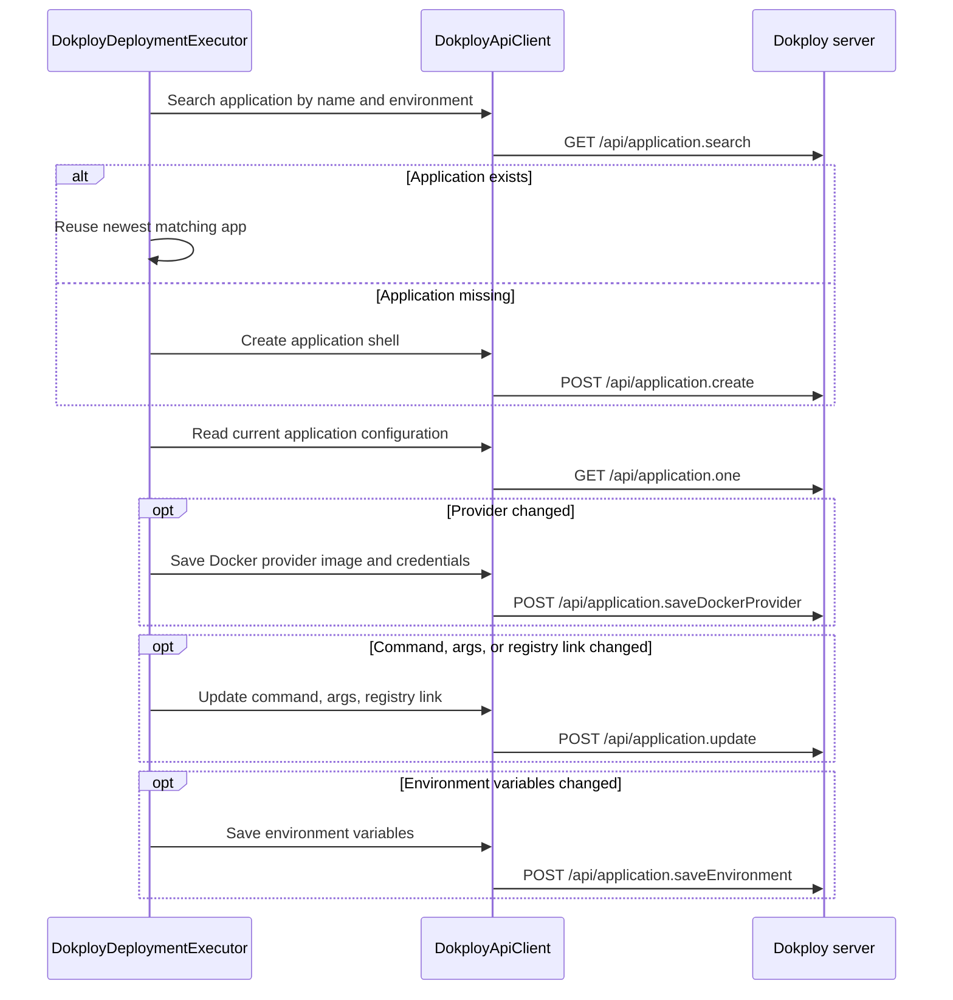

Application names are sanitized from Aspire resource names so they are safe as Docker/Dokploy identifiers. Existing applications are reconciled in place: the executor compares the desired provider, registry link, command, args, and environment variables with the current Dokploy state and skips writes when they already match.

## Domain synchronization

Existing Dokploy domains are preserved. If an application already has one or more domains, the executor reuses those domains and does not create a generated replacement. A new domain is created only when the application has no domains and the Aspire resource exposes an external HTTP or HTTPS endpoint.

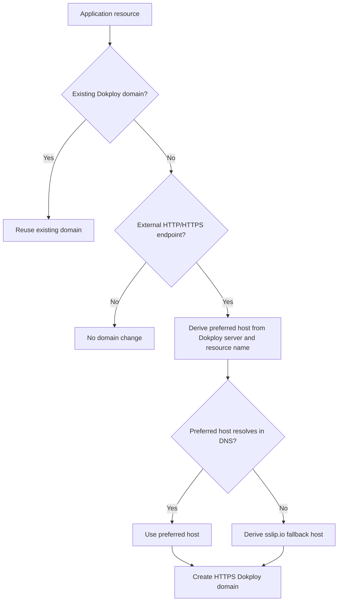

This preserves manual or previously generated Dokploy domains while still providing deterministic defaults for new public endpoints.

## Deployment triggering and summary

After applications are configured, the executor calls Dokploy's deploy endpoint only for applications that were created, changed, or are not in a successful deployment state. Unchanged applications are left running so Dokploy does not restart containers unnecessarily.

Finally, the executor writes an Aspire pipeline summary containing:

| Summary item | Meaning |
| --- | --- |
| Target | Always `Dokploy`. |
| Server | Normalized Dokploy server URL. |
| Organization | Active Dokploy organization, when available. |
| Project | Target Dokploy project. |
| Environment | Target Dokploy environment. |
| Application links | Public HTTPS links for resources with managed domains. |
| Registry | Auto-bootstrapped project registry host, when used. |
| Database endpoints | Native database host and port details. |

## Destroy sequence

When `aspire destroy` runs, the package does not execute Docker Compose locally. The stock `destroy-compose-{name}` step is replaced with named `dokploy-destroy-*` API cleanup phases that target the same project and environment parameters used during deployment.

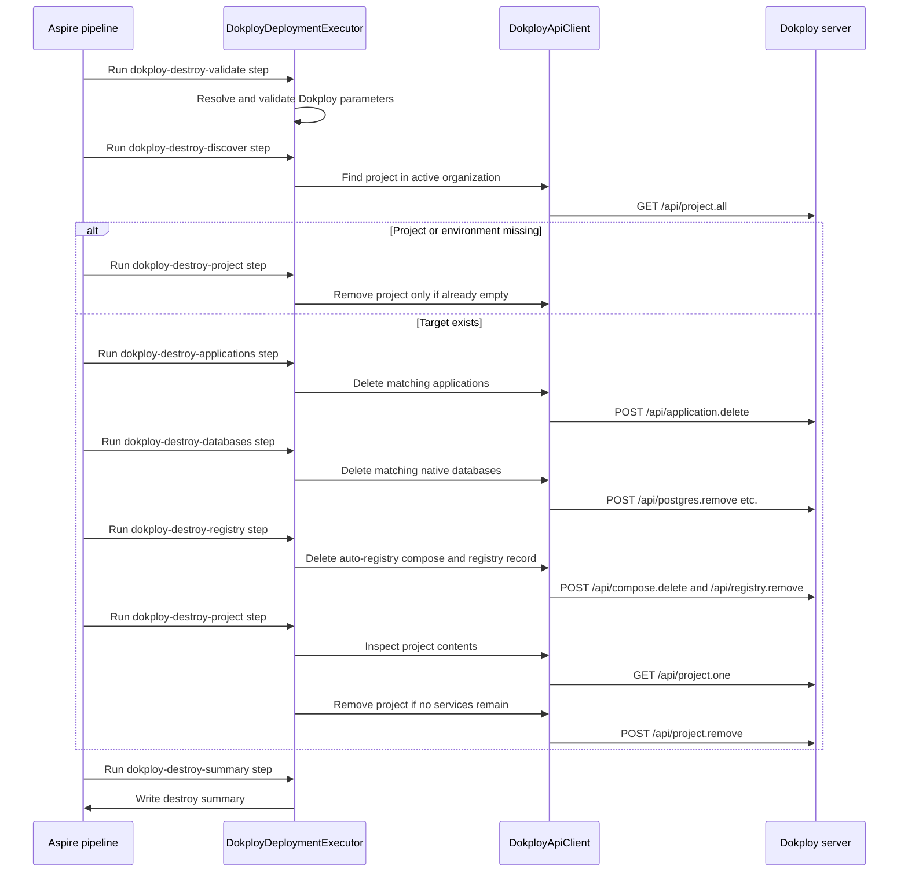

Destroy is intentionally name-scoped. Applications and databases are matched by the sanitized Aspire resource names that deployment uses when creating Dokploy services. The auto-registry cleanup is run only for deployments that would have used the project-scoped registry path, so explicit registries are not removed.

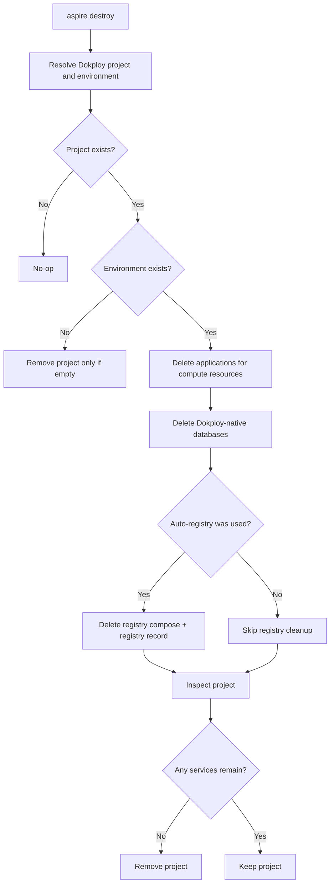

This cleanup model removes everything created for the Aspire deployment while avoiding deletion of unrelated Dokploy services in a reused project. If unrelated services remain, the summary reports that the project was kept.

## Error handling model

The deployment is designed to fail fast for configuration and server access problems:

- missing API key
- blank or invalid server URL
- unreachable Dokploy API
- failed project/environment creation
- failed registry bootstrap
- failed image push
- failed database provisioning
- failed application configuration
- failed deployment trigger

Some read-only discovery operations are best-effort. For example, domain discovery can return an empty set if Dokploy does not return the expected shape. These cases affect optional synchronization decisions, but write operations still surface failures.

## End-to-end mental model

The integration can be summarized as:

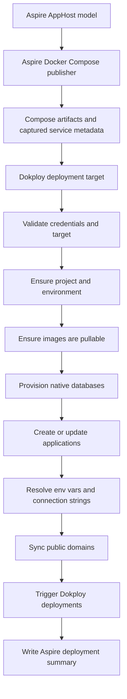

In other words, Aspire still describes and publishes the distributed application. Dokploy becomes the deployment backend that receives the published service metadata, receives or provisions the infrastructure it needs, and runs the application on the target Dokploy server.
